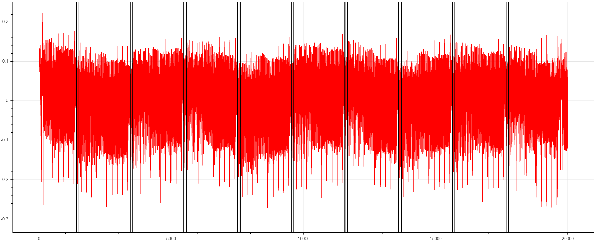
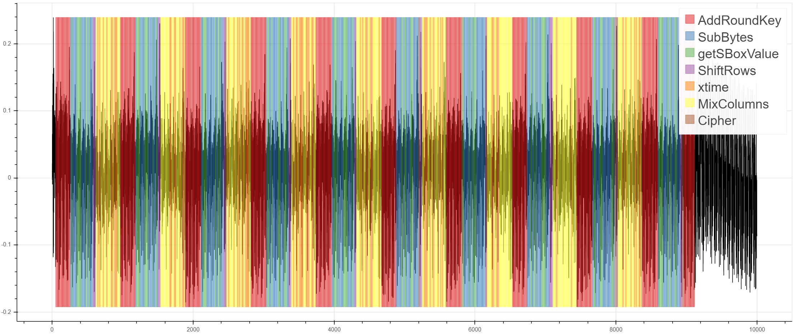
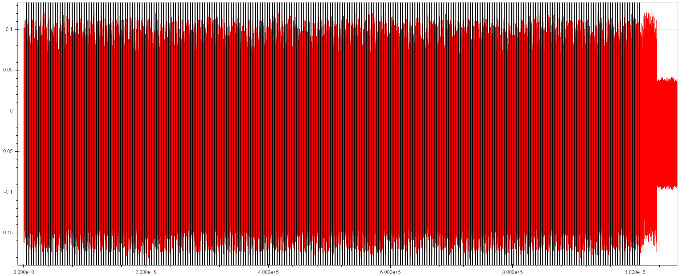

# DesignStartTrace

An Arm Coresight trace sniffer designed for use with the
[ChipWhisperer](https://github.com/newaetech/chipwhisperer) side channel
analysis platform.

DesignStartTrace allows you to leverage Arm trace technology to
**non-intrusively** learn what your target is doing at what time. You can
then combine this information with power traces collected by ChipWhisperer
hardware to facilitate and speed up your side-channel analysis.

## Examples
First, here's a few examples of what you can do with DesignStartTrace:

1. **Identify when a specific instruction is being executed.**
The ETM can generate trace packets when a specific PC value is reached. Here,
the target is executing AES, and trace packets are emitted at the start and
end of the ShiftRows operation:



2. **Identify functions or code segments with periodic PC sampling.**
The DWT can emit periodic PC samples. This allows you to easily visualize
and find functions on your power trace:



3. **Identify time leakage.** Non-intrusively and quickly check whether
sensitive code segments are time constant. Here we show the start of every
point addition in an ECC P-256 point multiplication. You can't see it here
because there's so many point additions, but there is in fact a significant
time variance in the length of each point addition, which could be useful
for a timing attack...



4. **Use any given trace packet as a power trace capture trigger.**
If inserting `trigger_high()` in your source code is a problem, this could
be the solution for you! Move the trigger anywhere you want, as many times
as you want, without ever having to recompile!


5. **Use any given trace packet as a time reference for fault attacks.**
Speed up evaluation of glitch-tolerant code by using trace to quickly get a
time reference to when sensitive code is executing. Again you could do this
without trace via `trigger_high()`, but this requires modifying source code
and recompiling -- unlike trace which is completely transparent and can be
enabled, disabled, or moved around without touching the source code at all.

Arm trace can generate **tons** of information about what your target is
doing. These examples are just scratching the surface of what's possible!


## Targets and Platforms
As its name implies, DesignStartTrace was first developed for the [Arm
DesignStart FPGA](https://developer.arm.com/ip-products/designstart/fpga)
platform, which is a free evaluation platform for Arm Cortex M1 and M3
processors. We ported the reference design to our
[CW305](https://rtfm.newae.com/Targets/CW305%20Artix%20FPGA/) side-channel
FPGA target board. Detailed instructions for porting are available here:
[https://github.com/newaetech/CW305-Arm-DesignStart](https://github.com/newaetech/CW305-Arm-DesignStart).

We then added trace sniffing logic to this to create "DesignStartTrace".
When implemented on our CW305 target board, this provides you with a Cortex
M3 along with our trace sniffing logic, co-located on the CW305's Xilinx
Artix 7 FPGA.  If you're already familiar with the ChipWhisperer target
framework, this target looks like any of our ChipWhisperer reference
targets, and so any existing target application can very easily be ported to
this platform and gain the power of trace.

If your target cannot be implemented on the CW305 platform, the trace
sniffing logic can also be implemented on the
[PhyWhisperer-USB](https://rtfm.newae.com/Tools/PhyWhisperer/). This can
support any target with a parallel trace port or SWO pin. Look to
[hardware/tracewhisperer](hardware/tracewhisperer) for this variant. This
platform provides all the same capabilities of trace, but with some gotchas
related to power trace noise which are discussed
[here](hardware/tracewhisperer/trace_noise.md).


## How it Works
The trace sniffer runs completely in hardware on the FPGA. It is basically
like PhyWhisperer-USB, but for trace. (In fact, about half of the Verilog
source code is shared with PhyWhisperer-USB.) Raw trace data is time-stamped
and stored internally in the FPGA. Up to 16Kbytes of trace data can be
stored. The cycle-accurate timestamping is what allows the collected trace
information to be usefully combined with power traces, as shown in the
examples above.


## How to Use It
If you're already familiar with ChipWhisperer, just add this to your
notebook:
```python
from chipwhisperer.capture.trace.TraceWhisperer import TraceWhisperer
trace = TraceWhisperer(target, scope)
```

and start having fun. This [example Jupyter
notebook](jupyter/TraceWhisperer.ipynb) shows a bunch of examples. This
notebook supports both CW305 and CW610 (PhyWhisperer) platforms. You'll need
ChipWhisperer capture hardware, and either a CW305 or a CW610. The target
may be the CWLITEARM; other targets with SWO and/or parallel trace ports
(such as the CW308 K82F target) can also be used.

Use `help(TraceWhisperer)` to see which methods are available.  At a low
level, trace is configured on the sniffing side via configuration and status
registers in the FPGA, all of which are accessible via the `fpga_read()` and
`fpga_write()` methods. On the target side, "There's More Than One Way To Do
It", but the method supported by `TraceWhisperer.py` uses additional
SimpleSerial commands to set the trace registers on the target.  See the
[simpleserial-trace](https://github.com/newaetech/chipwhisperer/blob/develop/hardware/victims/firmware/simpleserial-trace/simpleserial-trace.c)
example, which can easily be ported to any SimpleSerial target.


## Triggering
Once you've gone through the example notebook, read [this note on
triggering](triggering.md) to learn all the triggering options and
possibilities that are added by trace.


## Trace Jitter
Debug trace data has some jitter: if the same operation is run multiple
times on the target processor, and this operation generates the same debug
trace data each time, there will be small differences in the timing of this
trace data.

This jitter can be observed by running the [example
notebook](jupyter/TraceWhisperer.ipynb) and using trace as the trigger. To
use trace for side-channel analysis effectively, this jitter must be
understood and possibly dealt with.

The observations that follow are just that, observations made during the
development of this tooling; there is nothing in Arm's specifications which
guarantees some permissible range for this jitter.

### Jitter from Paralle Trace Port
When there is no trace data to output, synchronization frames are produced
continuously. These frames are 16 or 32 bits wide. It follows that with any
trace port width less than 32 bits, jitter is unavoidable. In practice, up
to 6 clock cycles of jitter have been observed with a 4-bit trace port.

In many cases, this jitter can be corrected / eliminated in post-processing,
e.g.  by re-aligning the power traces.

### Jitter from SWO Pin
When there is no trace data to output on the SWO pin, the link *can* be
idle, as long as the `SYNCTAP` field of the `DWT.CTRL` register is set to 0
(reference: ARM DDI 0403E.d, section C1.8.7). If these bits are not zero, a
periodic synchronization frame is emitted every 16M, 64M, or 256M cycles. If
a synchronization frame is being emitted when a trace event occurs, the
observation of the trace event could be delayed by hundreds of clock cycles!
Unless your application needs the synchronization frames, disable them to
avoid this situation.

The SWO baudrate sets a lower bound on jitter; for minimum jitter, set the
`TPI.ACPR` register to 0: this makes the baud rate equal to the target clock
rate. With this setting, it may be possible for there to be no jitter at all.
In practice, some jitter is frequently observed. The [uecc.ipynb attack
notebook](https://github.com/newaetech/chipwhisperer-jupyter/blob/master/demos/uecc.ipynb)
illustrates this and shows how jitter can be dealt with.

In addition, if trace acquisition is clocked from PhyWhisperer's SAM3U
clock, instead of the target clock, the asynchronous nature of these clocks
can result in small jitter on a small scale (1-2 cycles was observed with a
24 MHz target clock), and frequency drift which can build up on longer
captures. For example, for a trace that is 20 million clock cycles long at
24 MHz, jitter is sometimes seen to increase linearly throughout the
capture, starting a 2 cycles and ending at 8 cycles. The solution to this is
to source the trace acquisition from the target clock, not the SAM3U clock.

## Orbuculum
Raw trace data has somewhat complex layers of formatting. Fortunately,
[Orbuculum](https://github.com/orbcode/orbuculum) is a very nice open-source
trace parser which can be used to transform raw trace data into something
more useful.

For example, the raw trace data for two alternating matching PC addresses
looks like this, which is a bit of a mess to understand:
```
03 08 20 af 3a 00 00 84 
03 08 20 b3 3a 00 00 22 01 84 
03 08 20 af 3a 00 00 84 
03 08 20 b3 3a 45 00 00 01 84 
03 08 20 af 3a 00 00 84 
03 08 20 8a b2 3a 00 00 01 84 
03 08 20 af 3a 00 00 84 01 15 
03 08 20 b3 3a 00 00 84 
03 08 20 af 3a 00 00 22 01 84 
```

After feeding this through Orbuculum, you can clearly see the two
alternating addresses:
```
0x00003aae
0x00003ab2
0x00003aae
0x00003ab2
0x00003aae
0x00003ab2
0x00003aae
0x00003ab2
0x00003aae
```

(If you must know, section D4.2 of [ARM IHI
0029E](https://developer.arm.com/documentation/ihi0029/e/) will show you why
the raw trace data looks the way it does... don't say I didn't warn you!)


