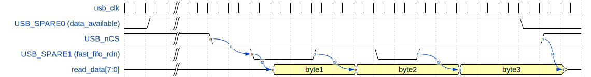

# FIFO Reads

This page presents low-level details for firmware developers on how the
captured trace data can be read from the FPGA.  In search of performance,
multiple methods for reading the captured data have been added over time.

## Basic Reads
The basic way to read the capture data is to read from the
`REG_SNIFF_FIFO_RD` register. Every read of this register gets a new byte of
annotated trace data. Each FIFO entry is 18-bits wide (why 18? that's the
width of the FPGA block RAM storage element). Since the data interface is
8-bits wide, each FIFO entry is returned over 4 consecutive reads of the
`REG_SNIFF_FIFO_RD` register.  The 18 bits of stored data are augmented by
FIFO status flags, which allows firmware to monitor the FIFO status without
having to read the `REG_SNIFF_FIFO_STAT` register separately.

The bytes received for each FIFO entry are, in order:

Refer to
[TraceWhisperer.py](https://github.com/newaetech/chipwhisperer/blob/develop/software/chipwhisperer/capture/trace/TraceWhisperer.py)
for an example of how the FIFO read data is parsed.

To increase the throughput of transferring captured back to the host
computer in a very simple way, a simple form of streaming is supported
whereby the `REG_SNIFF_FIFO_RD` register can be read continuously, even
if the FIFO is empty: internally, empty reads are blocked, and a special
flag is set on the returned data to indicate that there was no data
available. Thus, there is no risk of underflow. Nothing special needs to be
done to use this mode: just read, then filter out the empty read entries on
the host side.

## Fast Reads
To maximize throughput, a completely separate access mechanism was added.
First, the FPGA indicates whether the FIFO is empty via a dedicated output
pin (`USB_SPARE0`). Instead of executing a normal register read, firmware
can toggle a second dedicated input pin to the FPGA (`USB_SPARE1`) and the
next byte of FIFO data will be presented on the 8-bit USB data bus.
`USB_nCS` must also be active.

The `REG_FAST_FIFO_RD_EN` register must be set to enable this mode. Read
data is presented in advance of being requested: the rising edge of
`USB_SPARE1` is used to prepare the next read byte. The exception is the
first read byte, which is available one cycle after the first falling edge
of `USB_SPARE1`. The timing diagram below illustrates.

Reads on back-to-back cycles are not possible: `USB_SPARE1` must go high for
at least one clock cycle between every read.

`USB_nCS` must be held low for the duration of the FIFO read session. The
FPGA drives the data bus until `USB_nCS` is released, therefore register
writes are not possible during the FIFO read session.

There is no protection against underflow (reading an empty FIFO) in this
mode.

* t1, `USB_nCS` setup time: minimum 0 clock cycles
* t2, initial `USB_SPARE1` falling edge to read data available: 1 clock cycle
* t3, `USB_SPARE1` rising edge to next read data available: 2 clock cycles
* t4, `USB_nCS` rising edge to data bus released: 1 clock cycle
* t5, `USB_SPARE1` minimum active low time : 2 clock cycles
* t6, `USB_SPARE1` minimum inactive inactive time between reads: 1 clock cycle

Data is received in the same format as when reading from the
`REG_FAST_FIFO_RD_EN` register.

## 4x Faster!
If the application doesn't require the time-stamps that are normally
collected for each byte of trace data (which is what allows this captured
trace data to be combined with power traces to facilitate side-channel
analysis), then the FIFO reads can be sped up by a factor of 4. By setting
the `REG_TIMESTAMPS_DISABLE` register, only the raw captured trace data will
be returned: every byte that is read is a byte of trace data.

This option is only available in the "fast read" mode with `USB_SPARE0` and
`USB_SPARE1` that is described in the previous section; it is not available
when the FIFO is read via the `REG_SNIFF_FIFO_RD` register.

Timing requirements and constraints are as specified in the previous
section.

