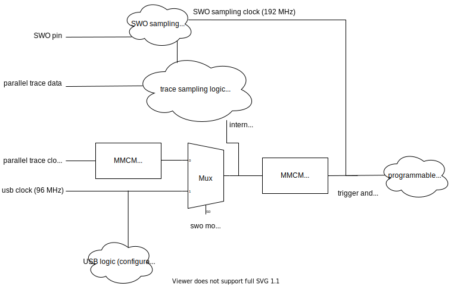

# TraceWhisperer Clocking

In order to overlay debug trace information onto power traces, the
relationship between the two different time bases must be understood.

With the usual synchronous clocking of the target, there are only two
options for the power trace: samples are either 4x per clock cycle or 1x per
clock cycle. Simple enough.

For debug traces, it can be a bit more complicated. 

The parallel trace case is simple, since the parallel trace data baud rate
is normally equal to the target clock, and so the parallel trace data is
sampled by what is effectively the target clock (and that is the case in our
examples, for both the CW305 and K82 targets).

The SWO case is more complicated because there's a couple of additional
variables. First, since SWO has no associated clock, it must be sampled
with an internal clock derived from the PhyWhisperer's 96 MHz USB clock.
Second, the SWO baud rate depends on both the target clock and its
`TPI.ACPR` register. 

Since the target clock is no longer directly tied to the trace sampling
clock, the relationship between those two clocks must be calculated.  [This
notebook](https://github.com/newaetech/DesignStartTrace/blob/master/jupyter/TraceWhisperer.ipynb)
shows a worked-out example of calculating the relationship between the
collected trace debug timestamps and the power trace.

This figure shows how clocks are managed internally in the PhyWhisperer:

