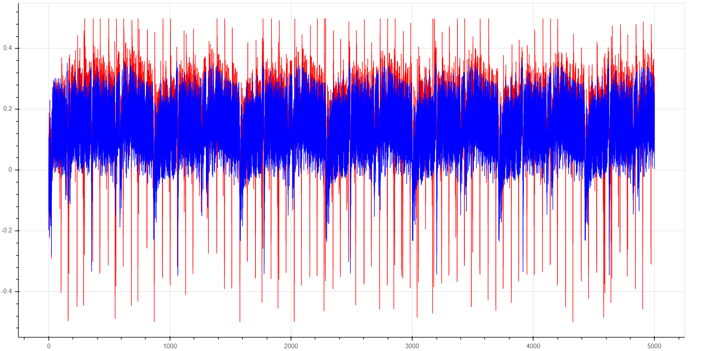
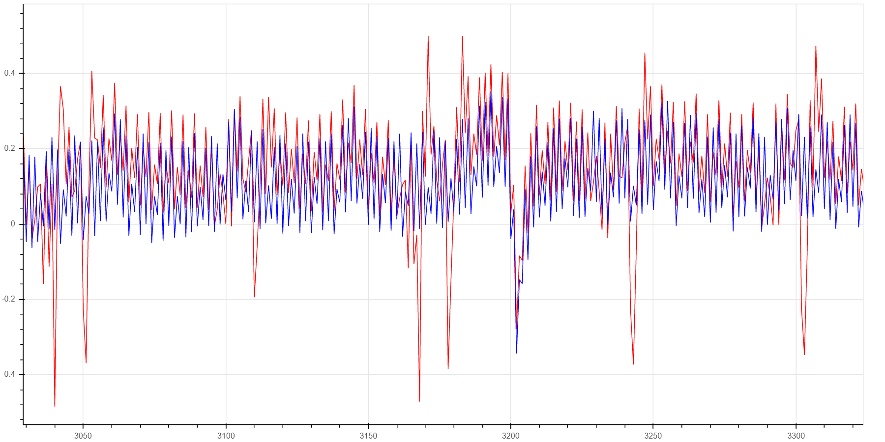
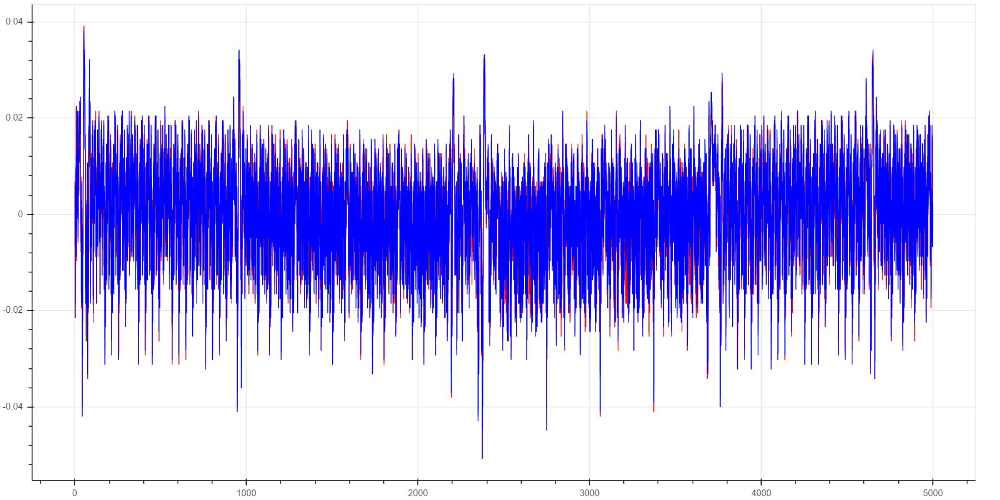

# Trace Noise With PhyWhisperer

Trace port activity can add significant "noise" to power traces. The figure
below shows this visually: two power traces were obtained where the K82F
target is doing the exact same AES operation.  For the blue power trace, no
trace packets are being emitted (only synchronization frames) For the red
power trace, periodic PC sampling frames are emitted every 64 clock cycles.

The next figure zooms in:

These figures show that trace port activity consumes a significant amount of
power. Furthermore, we know that there is jitter on trace port events: if
the exact same measurement is repeated, the trace packets are emitted with
some variable timing offset (a few clock cycles) relative to a stable
reference. This probably isn't good for side-channel attacks...

To measure the effect of trace activity on side-channel attacks, we carried
out the same CPA attack on an unprotected AES implementation for 5
different levels of trace activity.  The table below shows the average
remaining PGE (per key byte) for the given number of power traces.

| Trace Activity             | 20 traces | 50 traces | 100 traces | 200 traces | 1k traces | 5k traces | 8k traces |
|----------------------------|-----------|-----------|------------|------------|-----------|-----------|-----------|
| none                       | 0.3       | 0         | 0          | 0          | 0         | 0         | -         |
| trace clock only           | 105       | 83        | 58         | 0.2        | 0.1       | 0         | -         |
| sync frames                | -         | -         | 86         | 1.6        | 6.8       | 0         | -         |
| isync frames               | -         | -         | 110        | 97         | 38        | 0.4       | -         |
| PC samples every 64 cycles | -         | -         | 113        | 145        | 134       | 74        | 11        |

<em>Definitions:
* none = trace clock and data pins are idle
* trace clock only = the trace clock is active; trace data pins are
  idle
* sync frames: the trace port is active with continuous synchronization
  frames (30 or 15 ones, 1 zero; see [ARM IHI
  0029E](https://developer.arm.com/documentation/ihi0029/e/), section
  D4.2.2)
* isync frames: I-sync packet indicating an exact PC address match, 18 times
  per AES encryption
* PC samples every 64 cycles: periodic DWT PC sample packets
</em>

So even with **moderately** busy trace traffic which is not even close to
saturating the trace bus, up to **2 orders of magnitude more traces** are
required for a successful CPA attack.

## Avoiding Trace Noise
That is the bad news... the good news is that when trace sniffing is done on
the CW305 platform (where the soft-core Cortex M3 co-located on the same
FPGA with the trace sniffing logic, which means that trace events do not
cause any *external* pins to toggle), the additional power consumed by trace
activity is minimal. The figure below shows this visually (again, blue=trace
off, red=trace on):

Again, we quantify the effect of trace noise by running a CPA attack on an
unprotected AES implementation; in this case, we see no significant
different in the number of traces required for a successful attack.

Finally, note that if the CW308 + PhyWhisperer platform must be used, and
the tracing noise is problematic, the noise can easily be "removed" by
running the target operation twice: first with debug tracing enabled, then
with debug tracing disabled to capture the power trace. (This assumes that
the *exact* same operation can be repeated twice and that the target behaves
identically on repeated runs.)

