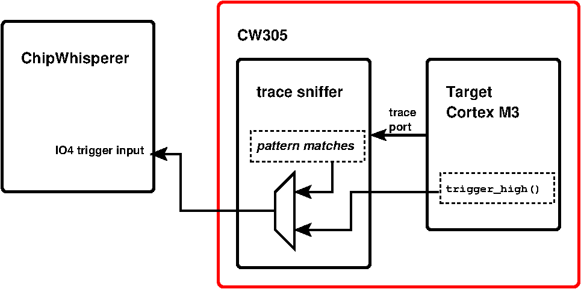
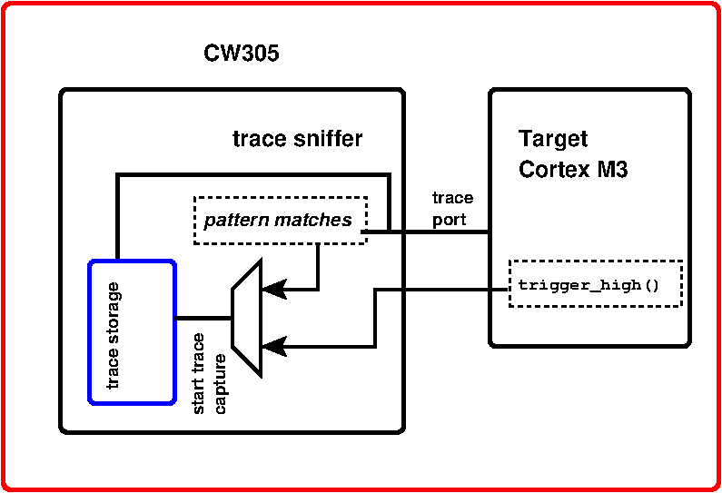

# Triggering with (or without) Trace

Trace adds several options for triggering, and the term itself "triggering"
now refers to two things: (1) triggering of ChipWhisperer, and (2)
triggering of the trace sniffer. So it can get a bit confusing. Let's start
by unpacking all the options; then we'll bring it back to two simple cases
that should work for most applications.

TLDR: to trigger power trace capture and processor trace capture from...
1. the target's `trigger_high()`: use `trace.use_soft_trigger()`
2. a trace pattern match: use `trace.use_trace_trigger(<rule id>)`

## 1. Triggering ChipWhisperer
The first "trigger" is the trigger that any ChipWhisperer user should be
familiar with: the `trigger_high()` that's added to the target source code,
which pulses the IO4 line and tells ChipWhisperer to start capturing the
power trace. This trigger has advantages (it is stable and jitter-free) and
disadvantages (it requires changing the source code), and it can still be
used with trace.

Trace adds a second method to trigger the power trace capture: a matching
pattern on the incoming trace data.

The figure below illustrates this:


To enable the Cortex soft trigger to pass through to the ChipWhisperer, the
following trace sniffer register must be set:

```python
trace.fpga_write(trace.REG_SOFT_TRIG_PASSTHRU, [1])
```

Alternatively, to use a trace pattern match as the ChipWhisperer trigger:

```python
trace.fpga_write(trace.REG_SOFT_TRIG_PASSTHRU, [0])
trace.fpga_write(trace.REG_PATTERN_TRIG_ENABLE, [2**<rule id>])
trace.fpga_write(trace.REG_TRIGGER_ENABLE, [1])
trace.set_pattern_match(<rule id>, <pattern>, <mask>)
trace.fpga_write(trace.REG_PATTERN_ENABLE, [<rule id>])
```

Up to 8 different rules (identified by \<rule id\> in the example code
above) can be programmed.

*TODO: add multiple programmable trigger documentation and helper function*

## 2. Triggering Trace
In order for trace data to be useful in side-channel research, we need to
timestamp the trace data relative to some event. The trace trigger sets that
time reference and also starts capturing the incoming trace data into an
internal storage FIFO.

Similarly to ChipWhisperer triggering, there are two methods for this: the
target's `trigger_high()`, and a trace pattern match.

The figure below illustrates:


To use the target trigger, simply add:
```python
trace.fpga_write(trace.REG_SOFT_TRIG_ENABLE, [1])
```

Otherwise, the trace trigger is used.

## Keep It Simple!

In most (all?) scenarios, you will want a common trigger for both the trace
capture and the external ChipWhisperer trigger.

In this case, these convenience functions will do all the work for you and
you can forget about almost everything else here:
```python
trace.use_soft_trigger()
trace.use_trace_trigger(<rule id>)
```

(For the pattern match trigger, you'll still have to set the pattern match,
mask, and rule ID via `set_pattern_match()` as shown above.)


